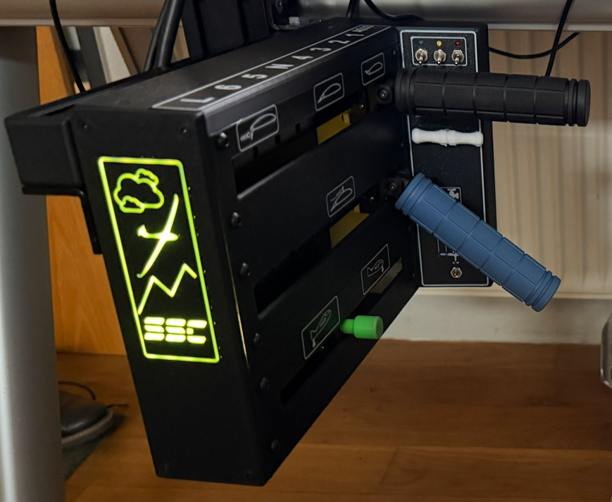

# SimGliderControl
**Realistic Precision Controller for Glider Flight Simulators**

## Features
- **Flaps Control** - Smooth, precise flap adjustment
- **Spoiler Control** - Accurate spoiler/airbrake positioning  
- **Trim Control** - Fine trim adjustment with rotary knob
- **Optional Controls** - Tow release, water ballast, wheel brake, electrical systems

## Technical Specifications
- **Arduino UNO** with Mobiflight software integration (or any other controller who support analog in)
- **Ball-bearing linear guides** for smooth, realistic movement
- **Wear-free Hall effect sensors** for precise, long-lasting position detection
- **Modular design** - customize to your cockpit needs

## ⚠️ Disclaimer

This project is provided as-is for educational and hobbyist purposes. While every effort has been made to ensure accuracy, the documentation, designs, and instructions may contain errors or omissions.

**Important Notice:**
- Building and using this controller is **at your own risk**
- The author(s) assume **no liability** for any damages, injuries, or losses resulting from construction or use
- Verify all measurements, specifications, and safety considerations before proceeding
- Electronic components should be handled with appropriate safety precautions
- If you're unsure about any step, seek advice from experienced makers or professionals

By using these plans and instructions, you acknowledge and accept these terms.

## Building Your SimGliderControl

### 3D Printing Instructions
Follow these step-by-step printing guides to create all necessary components:

1. **[Step 1: Base Components](Step1/print-instructions-step1.md)** - Foundation parts including guide shafts, linear guides, and mounting brackets
2. **[Step 2: Carriage Components](Step2/print-instructions-step2.md)** - Moving parts including guides, handle mounts, and detent holders
3. **[Step 3: Enclosure and Panel](Step3/print-instructions-step3.md)** - Housing and control panel options
4. **[Step 4: Control Panel](Step4/print-instructions-step4.md)** - Main cockpit interface panels with optional decals and LED lighting
5. **[Step 5: Handles and Controls](Step5/print-instructions-step5.md)** - Ergonomic handles, trim knob, and release mechanisms

### What You'll Need
- 3D Printer (min. 250×200×200mm build volume recommended)
- PLA and PETG filament
- 1x Arduino UNO or another controller of your choice with analog in
- 3x Hall effect sensors AS5600 Encoder (23mm x 23mm) with magnet (4mm x 2mm)
- 3x MGN12 250mm linear rail with MGN12B carriage
  **Important:** Design optimized for MGN12B (short carriage) for maximum control travel
  - MGN12C compatible: mounting holes identical, but reduces available throw by ~8mm per axis
- 15x bearings 8x3x3mm
- Standard hardware (3mm and 4mm screws and nuts)
- Basic soldering equipment

## Assembly

1. **[Step 1: Base Components](docs/ASSEMBLING-STEP1.md)**
2. **[Step 2: Carriage Assembly](docs/ASSEMBLING-STEP2.md)**
3. **[Step 3: Wiring and Calibration](docs/ASSEMBLING-STEP3.md)**
4. **[Step 4: Case](docs/ASSEMBLING-STEP4.md)**
5. **[Step 5: Handles and Mounting](docs/ASSEMBLING-STEP5.md)**

## Software Setup
*Mobiflight configuration guide coming soon*

## Community
[Sim Soaring Club Discord](https://discord.com/servers/sim-soaring-club-876123356385149009)
[Sim Soaring Club](https://simsoaring.club/)
[B21 Task Planner](https://xp-soaring.github.io/tasks/b21_task_planner/index.html)  
[WeSimGlide](https://wesimglide.org/)
[SSC-Tracker ](https://ssc-tracker.org/)

## License
Attribution-NonCommercial-ShareAlike 4.0 International

