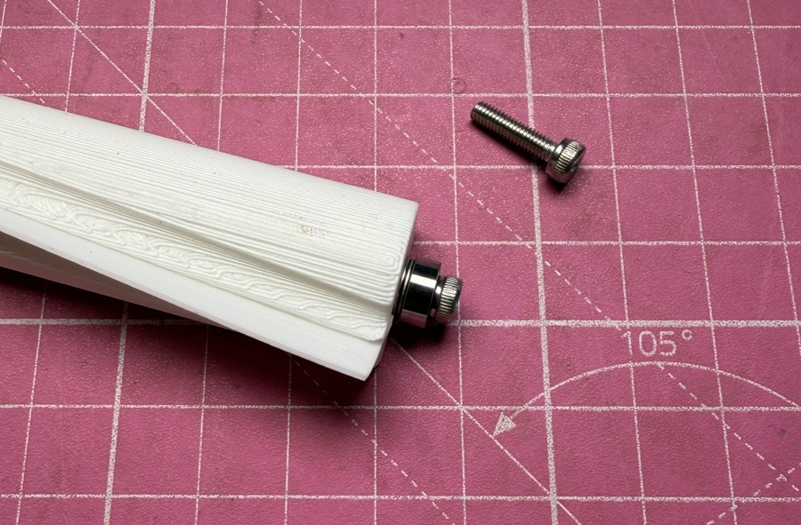
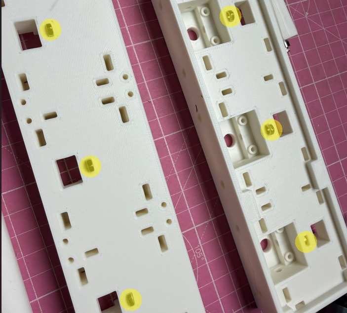
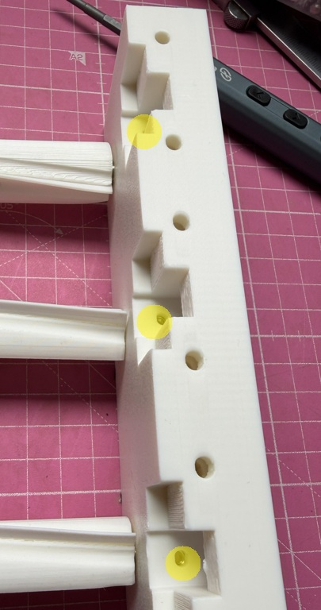
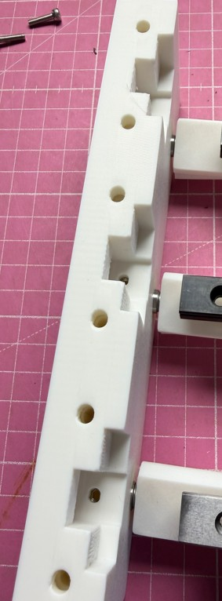
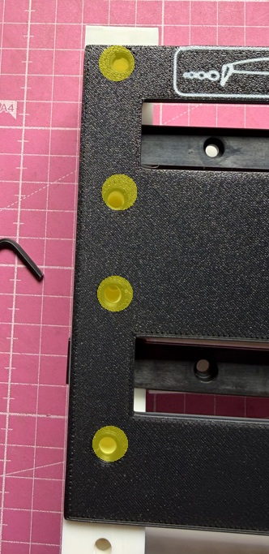
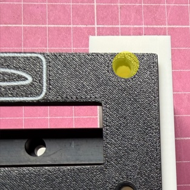

# SimGliderControl - Assembly Instructions

## Step 1: Base Assembly - Mounting Control Shafts and Linear Rails

### Required Parts
From printing:
- 3× GliderCtrBase_v1-GuideShaft
- 2× GliderCtrBase_v1-Mount1Assembly / Mount2Assembly
- 3× LinearGuide and carriage (MGN12B/C rails) (Maybe cleanup from too much oil required)

Additional hardware:
- 6× Ball bearings 8×3×3mm
- 12× M3 Allen head screws, 15mm length
- 6× M3 nuts
- M3 washers (quantity varies - 2-4 per shaft depending on tolerance)

### Tools Needed
- 2.5mm Allen key
- Small flat-head screwdriver (for nut insertion)

---

### 1.1 Attach Ball Bearings to Control Shafts

Screw a ball bearing (8×3×3mm) to each end of all 3 control shafts using 15mm Allen head screws.

**Important:** Depending on your print tolerances, use 1-2 washers on the shaft side. Whether you need more or fewer washers will become apparent only after fixing the linear rails in place.

**Note:** The screw head must be positioned as shown in the image. The magnet holder that will be slid on later is designed for this screw head size.

---

### 1.2 Insert Nuts into Mount Brackets

Insert 6× M3 nuts into the slots on both mount brackets and push them down until they sit centered with the screw holes.

**Tip:** Use a small screwdriver to push the nuts firmly into position.

---

### 1.3 Assemble First Side

Place one mount bracket upright and press all 3 shafts with bearings into position. Then slide in the linear rails as shown in the image.

---

### 1.4 Attach Second Mount Bracket

Press the bearings on the opposite side into the second mount bracket.

---

### 1.5 Alignment and Adjustment

Align the linear rails with the screw holes on both sides to check if the spacing is correct.

**Critical Adjustment:**
- You may need to add or remove washers on one shaft end
- The shafts should have **no play** (no wobble)
- The two mount brackets must **not push apart** from each other
- There should be slight preload, but not excessive tension

**Verification:**
Place the control panel on top to verify that both mount brackets are positioned at equal distance from each other and parallel.

Fix the linear rail with 6 M3 Allen head screws, 15mm and don't forget the MGN12B/C carriage before. 

---

### 1.6 Quality Check Before Proceeding

Before moving to Step 2, verify:
- ☑ All bearings rotate smoothly
- ☑ No play in the shafts
- ☑ Mount brackets are parallel and properly spaced
- ☑ Linear rails are aligned and seated properly
- ☑ MGN12B/C carriages is moving smoothly

---

**Next Step:** Once the base assembly is complete and verified, proceed to [Step 2: Carriage Assembly](ASSEMBLY_STEP2.md)
