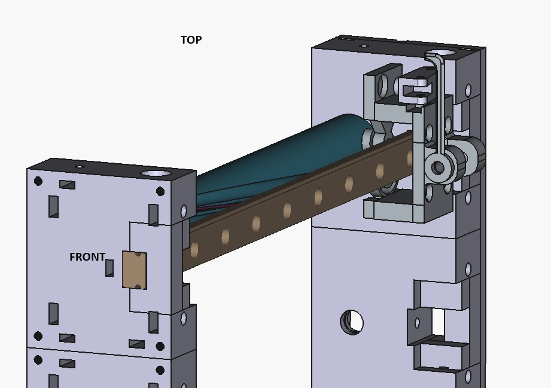
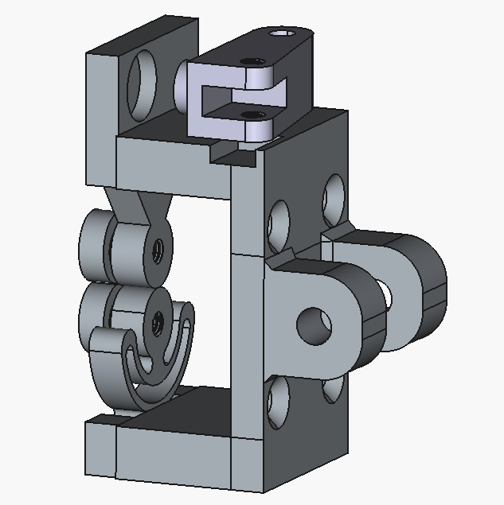
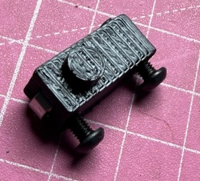
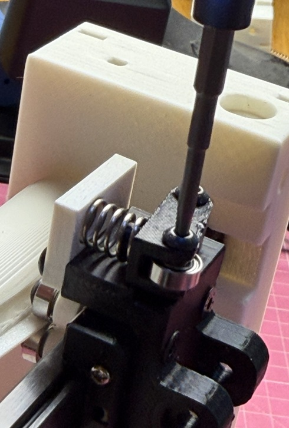
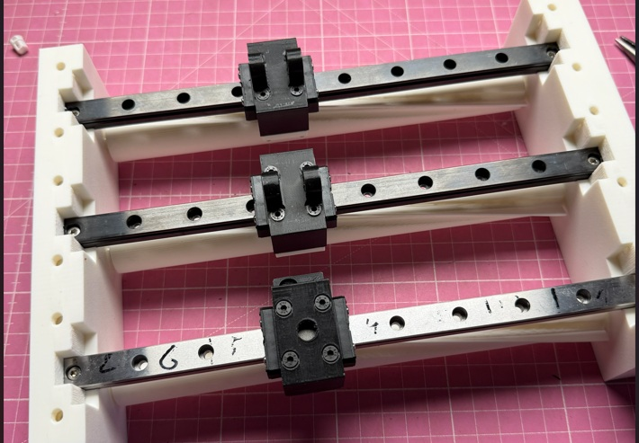
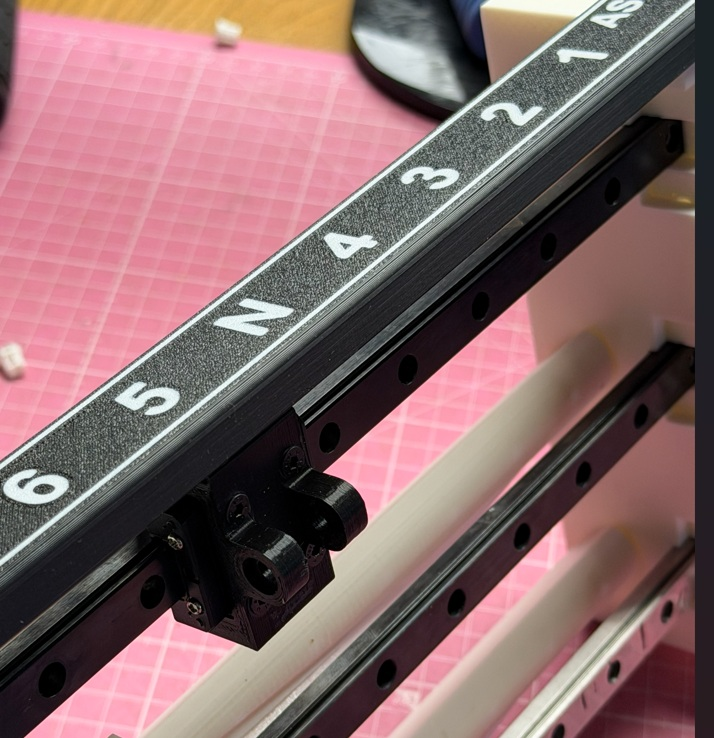
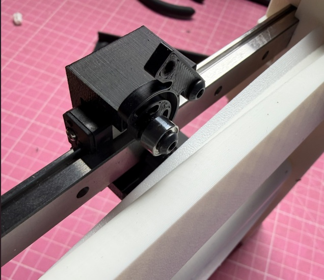
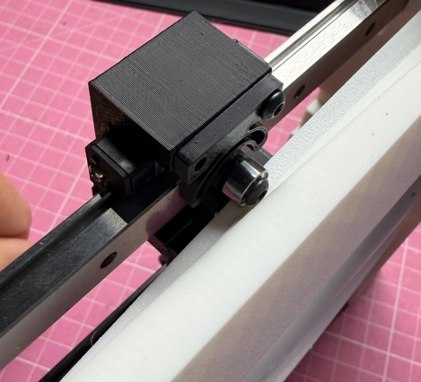
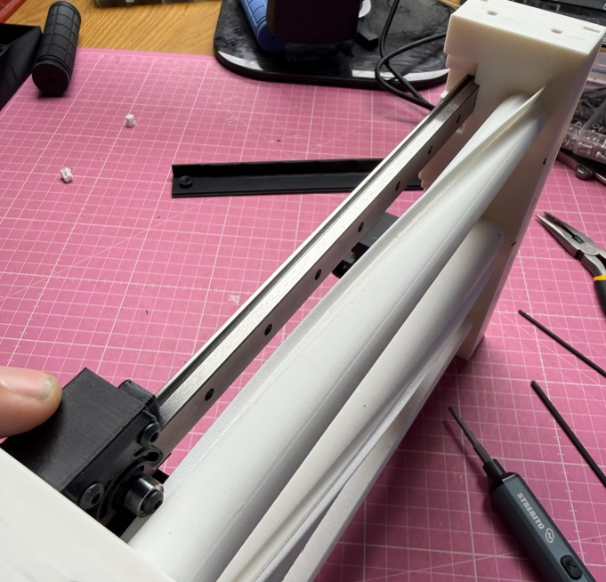

# SimGliderControl - Assembly Instructions

## Step 2: Carriage Assembly

### Required Parts
From printing:
- 2× GliderCtrCarriage_v1-HandleMount (for upper two rails)
- 1× GliderCtrCarriage_v1-KnobMount (for bottom trim rail)
- 3× GliderCtrCarriage_v1-FlexGuide
- 3× GliderCtrCarriage_v1-FixedGuide
- 1-3× GliderCtrCarriage_v1-DetendHolder (optional, for detent mechanism)

Additional hardware:
- 7-9× Ball bearings 8×3×3mm
- 1-3× Compression springs (8mm OD, 6mm ID, ~15mm length)
- 4× M3 countersunk screws (per carriage = 12 total)
- 9× M3 button head screws 10mm length
- 9× M3 button head screws 12mm length
- M3 button head screws 5-6mm length (for bearing mounting)

### Tools Needed
- 2.5mm Allen key
- Small screwdriver

---

### 2.1 Carriage Orientation

The carriages must be mounted on all 3 linear rails in the following orientation:

**Important:**
- 2× HandleMount for the two upper rails (flaps and spoilers)
- 1× KnobMount for the bottom trim rail

---

### 2.2 Detent Mechanism (Optional but Recommended)

The detent mechanism with spring and ball bearing is primarily designed for the topmost flaps control. However, it can be mounted identically on the other two carriages as well. Even if detent positions are not required there, it significantly improves the haptic feel of the sliders.

**Spring Selection:**
Use 1-3 steel compression springs (8mm OD, 6mm ID, ~15mm length) depending on desired pressure. You may need to experiment with the quantity to achieve optimal feel.

---

### 2.3 Assembling the Detent Lever

**Required per detent assembly:**
- 3× M3 button head screws 10mm
- 3× M3 button head screws 12mm  
- 1× Ball bearing 8×3×3mm

**Assembly steps:**

1. Mount the ball bearing with the 10mm screw as shown in the image. **Do not tighten completely yet** - it will serve as a locking pin after mounting the spring.

2. Attach the lever to the mount with the 12mm screw, leaving it loose enough for the lever to move freely.

3. Insert the spring, then tighten the 10mm screw on the ball bearing just enough to hold the lever in place.

**Important:** The spring pressure should not be too strong. We will test this shortly on the carriage with the flaps detent plate.

---

### 2.4 Mount Carriage to Linear Rail

Mount each HandleMount/KnobMount to the rail carriage using 4× M3 countersunk screws.

**Critical:** The screw heads must be flush or below the surface - there is very little clearance for the cover later.

---

### 2.5 Test Detent Pressure

Place the detent plate on top for testing and check the spring pressure. The plate will be held securely by magnets later, but it should not bend under the spring pressure.

**Adjustment:** If pressure is too high or too low, adjust by:
- Adjust spring length
- Using different spring strengths

---

### 2.6 Mount Guide Bearings

Now mount the guides on all 3 carriages.

**Preparation:**
1. First, carefully attach all bearings to the raised side of the 3 FlexGuides and 3 FixedGuides using M3 button head screws (5-6mm length).

**Assembly sequence:**
1. Mount one side (bottom) to the mount first
2. Loosely attach the opposite guide with just one screw initially
3. Rotate the shaft so the guide presses against the fixed bearing
4. Then tighten the second bearing

**Critical adjustment:** There should be no play, but also not too much pressure. If necessary, loosen the screws and adjust the holders in the screw holes.

---

### 2.7 Movement Test

Move the carriage back and forth several times. It should move smoothly and securely over the entire length of the rail.

**If movement is stiff or rough:**
- Check bearing alignment
- Verify no screws are protruding
- Adjust guide pressure by loosening/repositioning
- Ensure FlexGuide has slight flexibility

---

### 2.8 Final Verification

Before proceeding, verify:
- ☑ Orientation matches the first image in this step
- ☑ KnobMount is on the bottom (trim) rail
- ☑ All carriages move smoothly over full travel
- ☑ No excessive play in guides
- ☑ Detent mechanism engages properly (if installed)

---

**Next Step:** Once the carriage assembly is complete and verified, proceed to [Step 3: Calibrating and Wiring](ASSEMBLING-STEP3.md)
