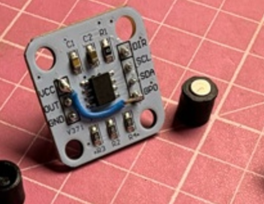
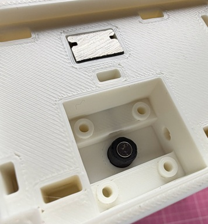
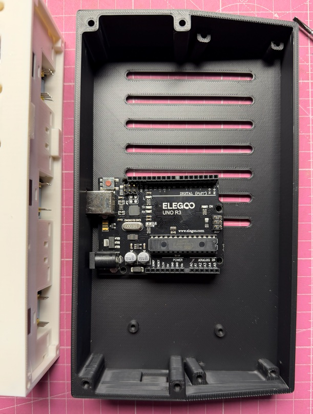
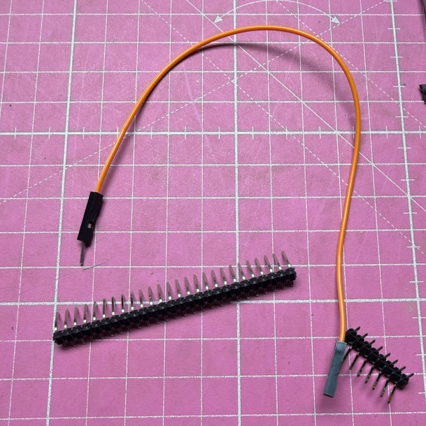
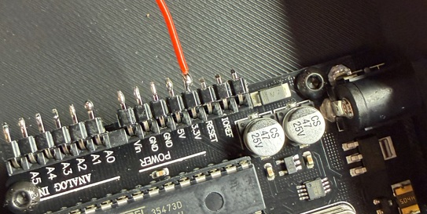
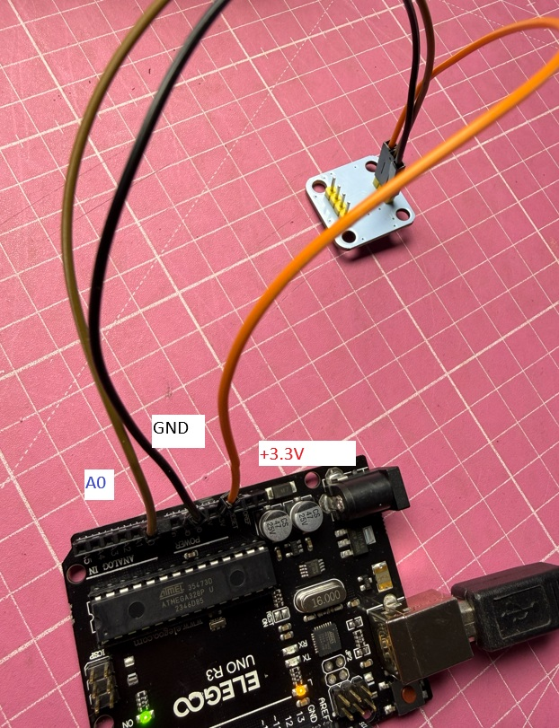
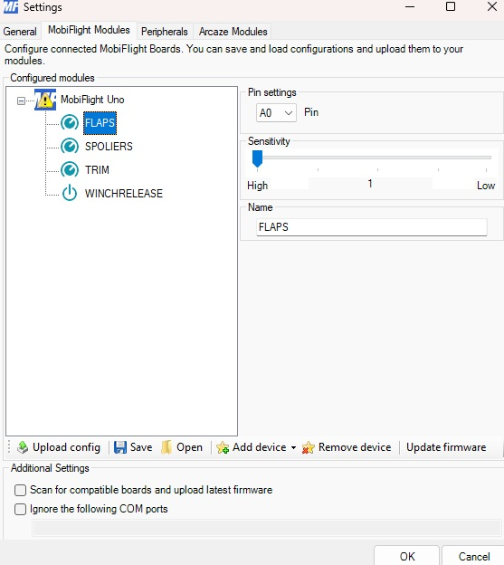
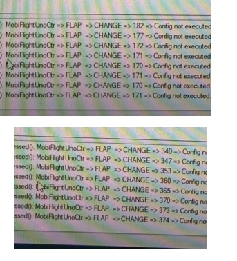
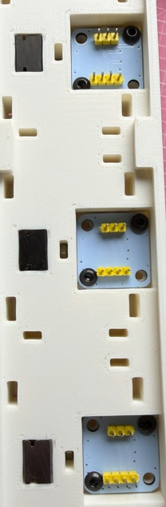
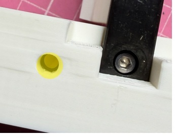

Step 3: Wiring and calibration

Montieren und Kalibrieren der Hall Sensoren

3x Hall effect sensors AS5600 Encoder (23mm x 23mm) with magnet (4mm x 2mm)
1x Arduino UNO or compatible
10x 3 x 5 mm Linsenkopfschrauben 

Download and install Mobiflight Software from https://www.mobiflight.com/en/download.html
(Als Einstieg ist https://docs.mobiflight.com/getting-started/ zu empfehlen)

Die Hall Sensoren können in 2 Modi betrieben werden, mit einem digitalen Ausgang oder analogen Ausgang.
Für den Arduino mit Mobiflight Firmware setzen wir hier die analoge Variante ein.

Der Sensor liefert absolute analoge Werte über den vollen Drehwinkel 0 - 360 Grad.
Am Pin A0 - A2 am Arduino und dem 10 bit AD Wandler resultiert das bei einem Drehwinkel von ca. 120 Grad in einer Auflösung von ca 210-220 Schritte.
Achtung! Der Sensor wird an GND  und 3.3V Pin vom Arduino mit strom versorgt!
Dadurch reduzieren sich die ca 1024 möglichen Werte am Analog Port auf ca. 675. Mit 120 Grad Drehwinkel nochmal auf 1/3 = ca. 220.
Auf den möglichen controllerweg von ca 180 mm ist die Auflösung damit kleiner als 0.9 mm.

Für den analogen Betrieb muss GPO und VCC gebrückt werden, entweder wie auf dem Bild oder später über die Stiftleisten.
Die beiden Stiftleisten müssen rückwärtig angelötet werden. 

Der Magnet muss in den Magnethalter gedrückt werden, er sollte nicht herausfallen, anonsten einen Tropfen Klebstoff dazu.
Magnet nicht verlieren, sie haben eine spezielle Ausrichtung, die nicht mit herkömlichen Magenten ersetzt werden können.

Die Magnethalter anschliessend fest auf die Imbusschraube der Welle drücken. Sie sollte ebenfalls nicht von selbst herausfallen und sich frei mit der Welle drehen können.
Einen Hall sensor jeweils testweie einsetzen, sie dürfen nicht kippeln und müssen flach auf allen 4 Schraubensockeln aufliegen.
Der Magnet darf nicht eingeklemmt werden, der Abstand aber auch nicht zu gross sein. 
Beim kalibrieren wird die korrekte Funktion überprüft.

Kalibrieren

Den Arduino an einer der beiden montagepunkte mit M3 Schrauben im Gehäuse befestigen, VCC an 3.3V Pin, GND an einen GND Pin anschliessen.
OUT an den A0 Pin.

Arduino mit dem PC verbinden.
- Mobiflight starten und "Mobiflight Modules" anklicken. Der Arduino sollte in der Modulliste erscheinen, "Compatible" oder "Arduino UNO".
- Upload/Update Firmware unten anklicken und der Arduino steht anschliessend als Modul bereit.
- Auf dem Modul mit der rechten Maustaste 3 Analog Ports hinzufügen (A0 - A1)
- Sensitivity kann auf High (max. AUflösung)
- ALs Name kann man FLAPS, SPOILERS und TRIM verwenden
- In der minimalen Ausstattung kann man auch bereits einen beliebigen DIgitalen "Button" Input hinzufügen
- "Upload config"
- "save" modul config in a file (*.mfmc)

Ein Mobilflight Setting besteht aus 2 Dateien, einer Modul Config und einem Mapping der Modul Ports zu Sim Variablen.

im root des Repos befinden sich GliderCtr.mcc für das Mapping und MobiFlightUnoGliderCtr.mfmc für die Module Config als Volrage mit Mapping zu den MSFS Simvars.
Hier ist das Modul bereits mit den Pins konfiguriert.
Die mitgeliefert Mobflight Config ist auf einer anderen Hardware ID gemappt, beim ersten Anschluss kann dieser über einen Dialog auf ihren geändert werden.
Danach beide COnfigs sichern. JEde Änderung an dem Modul erfordert ein erneutes Upload und sichern (mfmc).
Jedes Ädnern am Mapping ein sichern der mcc Datei.

Für die korrekte Orientierung der Sensoren benötigen wir ein konfiguriertes Arduino Modul und Mobiflight.
Den ersten Hall Sensor anschliessen und erstmal nur lose in einem SLot einsetzen.
In Mobiflight unter Extra > Setting Logging und Debug aktivieren.

Im Log sollten dann Werte vom angeschlossenen Eingang durchlaufen und sich mit dem bewegen des carriage verändern.
Wenn nicht, das ganze wiring und setting überprüfen.

Im Beispiel haben wir Korrekte Werte von 170 - 374 = 204 Schritte
Stellen sie sicher, das über den gesamten controllerweg die werte nicht über 0 laufen.
Wert1 600 und Wert 2 150 wäre falsch, der minimale Wert muss unter 400 liegen und der maximale Wert entsprechend ca 200 Schritte höher.
DEr WErt muss später über eine Formel in den für den MSFS erforderlichen Wert von -16383 - +16383 umgerechnet werden.
Wenn der Wert über 0 läuft, funktioniert die Formel nicht.

Setzen sie den hallsensor um 90 grad gedreht wieder ein, bis sie korrekt incrementieren und fixieren sie ihn anschliessend mit 2 kurzen M3 Schrauben.
Führen sie das mit allen Sensoren so durch.

In diesem Fall war die Orientierung bei allen ensoren zufällig identisch.

Zuletzt verbinden sie final alle Sensoren mit dem Arduino. Schrauben sie das Gehäuse noch nicht an.
Starten sie wiederrum Mobiflight. Nun müssen inm mobflight mapping die für jeden sensor korrekten WErte in die FOrmel eingetragen werden.

Bewegen sie jeweils den carriage hin und her und merken sie sich den min und max Wert.
Tragen sie den Min Wert und die Anzahl der Schritte zu max jeweils korrekt in Formel ein.
Die Formel ist in Mobiflight nach der polnischen Notation aufgebaut, was bei flaps dem entspricht: = @ - 170 / 204 * 32766 - 16383
@ steht für den analogen wert am eingang.

Beispiel für FLaps:
170 - 374 = 204 Schritte

@ 170 - 204 / 32766 * 16383 - (>K:AXIS_FLAPS_SET)

Beispiel für SPolier:
67 - 290 = 223 Schritte

@ 67 -  223 / 16383 * (>K:AXIS_SPOILER_SET)

Beispiel für Trim:
211 - 432 = 221 Schritte
@ 211 -  221 / 32766 *  16383 - -16383 max 16383 min (>K:ELEVATOR_TRIM_SET)

Diese Kalbrierung sollte nur einmal notwendig sein.

Bevor das Gehäuse angeschraubt wird, sollte die Funktion mehrfach überprüft werden, die Hall Sensoren sind so genau, das die Werte an den Endpunkten smax. um 2-3 Schritte varieren.
Sonst den Magnethalter und den Abstand zum hall Sensor überprüfen, im idealfall passen nur 1-2BLatt Papier zwischen Chip und Magnet.

Setzen sie 12 stck  M4 Muttern jeweils in die Halter auf beiden seiten.

So weit, dass sie zentriert im Schraubenloch sitzen.

Setzen sie 4 M3 Muttern für die BEfestiung des Gehäuses in den Mount
Schrauben sie das Gehäuse mit 4 M3 15mm Schrauben an. Klemmen sie dabei keine Kabel ein.
Je nach Arduino Einbausituation achten sie auf korrekte Verkabelung am Arduino.
VErwenden Sie weitere Schalter und LEDs am Gehäuse, sollten auch diese bereits verbunden werden.
Grundsätzlich werden Schalter bei Mobiflight über GND an einen beliebigen I/O Pin geschaltet.
Wie und ob sie weitere Funktionen benötigen hängt von der gewünschten Konfiguration dem FLugzeug und zur VErfügung stehenden VAriablen ab.
Das ist ein deep dive in die tausenden Möglichen Simvars von mobiflight zum MSFS und anderen.

**Next Step:** Once the carriage assembly is complete and verified, proceed to [Step 4: Front plates](ASSEMBLY_STEP4.md)

